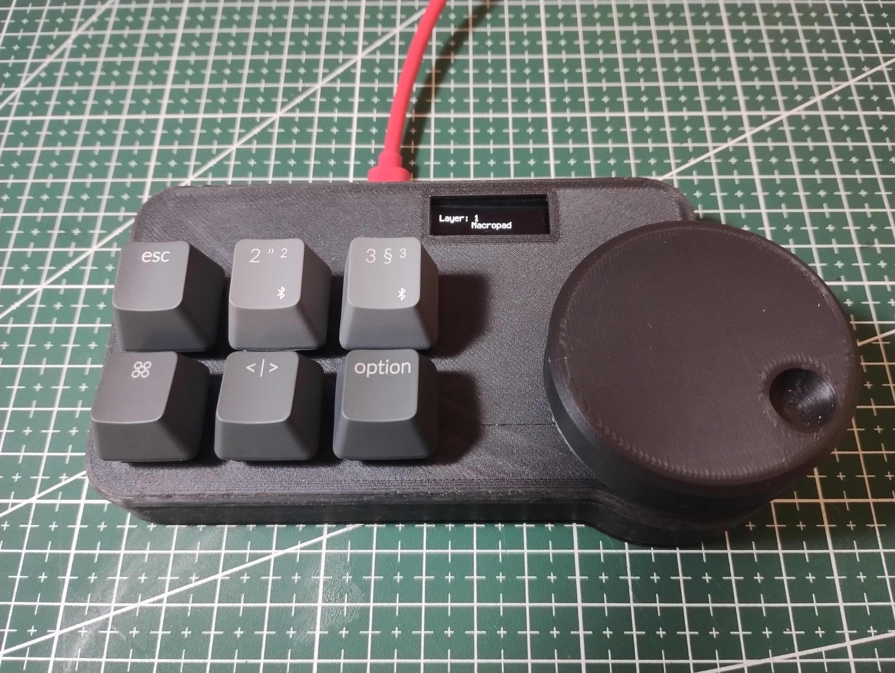

## Leme macropad

This is a macropad based on the RP2040 microcontroller meant to run QMK.

It currently is a handwired macropad using a raspberry Pi pico

The [README in the software directory](software/README.md) explains how to install QMK on a raspberry pi pico to support it.

The [leme_macropad](leme_macropad/) directory contains a first revision for custom hardware for it (which, unfortunately, currently doesn't work).
